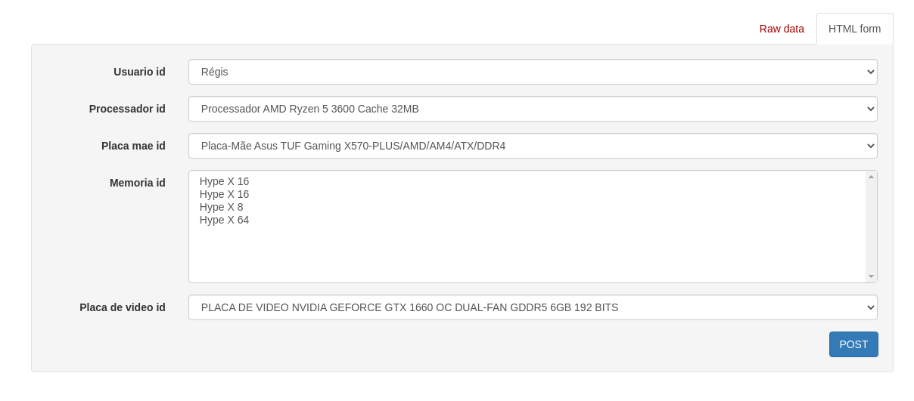

# Silvertec Informática

**Primeiros passos do projeto**

- pip install -r requirements.txt
- python manage.py migrate
- python manage.py createsuperuser

- python manage.py runserver

# Aqui você pode visualizar e usar o post

- Insira os dados na app produtos em admin e utilize a descricao para saber os atributos da peça de computador 
- http://127.0.0.1:8000/montagem/ para acessar a api
 

